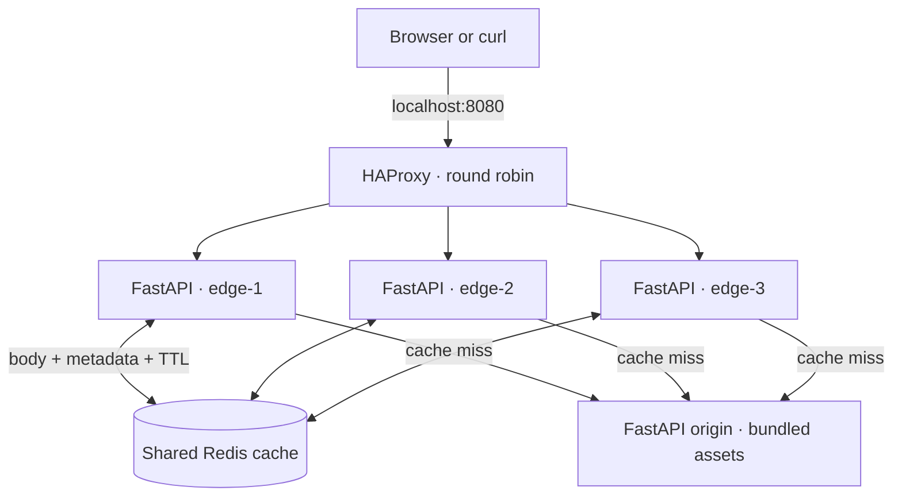

# mini-cdn

[](https://github.com/ellasypark/mini-cdn/actions/workflows/ci.yml)


**Follow an asset from origin to cache, across three load-balanced edges, on your own laptop.**

A local-first CDN learning project built with Python/FastAPI, HAProxy, Redis, and Docker Compose.
One command starts the whole system. Response headers show which edge handled a request, whether
Redis served it, and how long the cached object has left to live. No cloud account, domain, paid
service, or Terraform is required.

## Architecture



1. HAProxy selects a healthy edge using round robin.
2. The edge hashes the fixed origin URL, asset path, and full query string into a Redis key.
3. On a **HIT**, Redis returns the body and metadata; the origin is never contacted.
4. On a **MISS**, the edge fetches the origin and stores eligible content with an atomic Redis TTL.
5. After expiry, the next request fetches a fresh copy. All three edges share the same cache.

This is a CDN **simulation on one machine**, not a geographically distributed CDN. The shared
cache makes cross-edge reuse easy to observe; real CDN points of presence usually have their own
cache tiers. Redis and the origin are single instances in this starter.

## Start in a minute

Install a container engine with Docker Compose v2.20+ and start it. The first build downloads
images and Python packages; subsequent runs serve the bundled assets locally.

```bash
git clone https://github.com/ellasypark/mini-cdn.git
cd mini-cdn
docker compose up --build --wait
curl -i http://localhost:8080/assets/hello.txt
```

Repeat the request to see `X-Cache: HIT`. Try `/assets/example.json` and `/assets/style.css` too.
The only published port is `127.0.0.1:8080`. Internal service ports are not exposed to the host.

```bash
# A unique query string starts with a fresh cache key.
demo=$(date +%s)
for i in 1 2 3 4 5 6; do
  curl -sS -D - -o /dev/null "http://localhost:8080/assets/hello.txt?demo=$demo"
done
```

Expect one `MISS`, then `HIT` responses rotating among `edge-1`, `edge-2`, and `edge-3`.
`X-Origin-Request` stays the same across hits, proving the origin response was reused.
After the default 30-second TTL, the next request is a `MISS` with a new origin request ID.
The first edge selected can vary because health checks and other requests also use the system.

| Header | What it tells you |
| --- | --- |
| `X-Cache` | `MISS`: fetched and stored; `HIT`: served from Redis; `BYPASS`: not cached |
| `X-Edge-ID` | Edge process that handled this response |
| `X-Cache-TTL` | Approximate seconds of cache freshness remaining |
| `Age` | Whole seconds since this edge cache entry was created |
| `X-Origin-Request` | Origin request ID, preserved inside the cached entry |
| `ETag` | SHA-256 of the bundled asset, preserved through the edge |

Errors generated by the gateway itself (for example, an origin timeout) use FastAPI's JSON error
format and do not include the cache diagnostic headers.

## Configuration

Copy `.env.example` to `.env` to customize Compose. Apply changes with `docker compose up -d`.

| Variable | Default | Purpose |
| --- | --- | --- |
| `CDN_PORT` | `8080` | Local HAProxy port |
| `CACHE_TTL_SECONDS` | `30` | Maximum edge cache lifetime; must be positive |
| `ORIGIN_TIMEOUT_SECONDS` | `5` | HTTPX timeout per origin network operation |
| `MAX_ASSET_BYTES` | `2097152` | Maximum decoded asset size (2 MiB) |

Each edge also reads `EDGE_ID`, `ORIGIN_URL`, and `REDIS_URL`, supplied by Compose.
The origin URL is a fixed HTTP(S) origin without a path or credentials, never a client-supplied URL.
The origin publishes a 60-second lifetime; the edge uses the smaller of that and its configured TTL.
Cache entries keep their original TTL when configuration changes. To start with an empty cache,
restart Redis with `docker compose restart redis` (cache persistence is intentionally disabled).

## Cache contract

- Only `GET` and `HEAD` under `/assets/` are supported. `HEAD` shares the `GET` cache entry;
  a cold `HEAD` fetches the complete asset and returns headers without a body.
- Cache only `200` responses explicitly marked `public` with a positive `s-maxage` or `max-age`.
  The edge caps that lifetime and subtracts an upstream `Age`, when supplied.
- Do not cache `private`, `no-cache`, `no-store`, `Vary`, `Set-Cookie`, errors, or redirects.
  Redirects are rejected with `502` and never followed.
- Client `Cache-Control: no-cache` or `no-store` bypasses reads and writes for that request.
  It does not purge an existing cached object.
- Requests with `Authorization` or `Cookie` are rejected: this is a public-asset lab.
- Query strings are preserved, including order, and form part of the cache key. The demo origin
  ignores queries; use `?v=2` to create a new key.
- Downstream responses use `Cache-Control: no-store` so browser caching does not hide the Redis
  behavior. This setting is intentional for the learning demo.
- No range requests, conditional revalidation/`304`, streaming large files, cache purge API,
  distributed request coalescing, or stale serving. Concurrent cold requests may each fetch origin.
  `ETag` is exposed for inspection, but the gateway does not implement conditional requests.

Redis has a 64 MiB memory limit with LRU eviction. Bodies are base64-encoded inside JSON alongside
their metadata; this is inspectable but adds roughly one-third to binary body storage. Expiry is
set together with each entry using Redis `SET ... EX`, so body and metadata cannot outlive each other.

## Health checks and failure experiments

| Endpoint | Meaning |
| --- | --- |
| `/healthz` | Edge process is serving; used by HAProxy and container health checks |
| `/readyz` | Edge can reach Redis; returns `503` during a Redis outage |
| Origin `/healthz` | Internal origin process health |

Readiness intentionally does not gate HAProxy routing: if Redis fails, live edges can still fetch
the origin. Origin reachability is not part of edge liveness, so cached content stays available
when the origin is down.

```bash
# Remove an edge; after about 4–5 seconds HAProxy routes to the other two.
docker compose stop edge1
curl -i http://localhost:8080/assets/hello.txt
docker compose start edge1

# Redis failure: assets still load, now with X-Cache: BYPASS.
docker compose stop redis
curl -i http://localhost:8080/assets/hello.txt
curl -i http://localhost:8080/readyz
docker compose start redis

# Warm an asset, then stop the origin. Warm HITs work until their TTL expires.
curl -i http://localhost:8080/assets/hello.txt
docker compose stop origin
curl -i http://localhost:8080/assets/hello.txt
curl -i 'http://localhost:8080/assets/hello.txt?cold=1'
docker compose start origin
```

An uncached request returns `502` for an unreachable origin or `504` for an origin timeout.
No stale entry is served after its TTL. If both Redis and the origin are unavailable, the request fails.

## Tests and development

Python 3.12+ is needed only for local development and the smoke script; Compose runs Python itself.

```bash
python3 -m venv .venv
source .venv/bin/activate
python -m pip install -r requirements-dev.txt
python -m ruff check .
python -m ruff format --check .
python -m pytest --cov
python -m build --no-isolation

# With Compose running, test real HAProxy + Redis + origin and wait for TTL expiry.
python scripts/smoke.py --check-expiry
```

Unit tests use a mocked HTTP origin and fakeredis; they require no running Docker services.
The smoke test uses real containers and verifies all three edge IDs, miss → hit → expiry,
identical bodies, stable origin request IDs, `HEAD`, and missing files.

GitHub Actions runs two jobs:

1. Ruff lint/format, pytest with an 85% coverage floor, and Python source/wheel builds.
2. Build and start all six containers, run the smoke test with a short TTL, stop one edge,
   and verify traffic still reaches the remaining two. Always clean up the stack.

Runtime and development dependencies are pinned in `requirements.txt` and `requirements-dev.txt`.
To refresh them intentionally, install [uv](https://docs.astral.sh/uv/) and run:

```bash
uv pip compile pyproject.toml --python-version 3.12 -o requirements.txt
uv pip compile pyproject.toml --extra dev --python-version 3.12 -o requirements-dev.txt
```

Container tags track Python 3.12, HAProxy 3.2, and Redis 7.4 patch releases. Rebuild with
`docker compose build --pull` to refresh base images. They are not locked to image digests.

Add demo files under `mini_cdn/assets/`, then rebuild. Clear Redis or wait for TTL expiry to see
updated files at an existing path. `make up`, `make down`, `make logs`, `make lint`, `make test`,
`make build`, and `make smoke` are shortcuts for the same commands.

## Project map

```text
mini_cdn/
  edge.py          Public asset gateway and cache flow
  origin.py        Static origin with ETags and request IDs
  cache.py         Cache key, entry encoding, and TTL policy
  config.py        Environment configuration and validation
  assets/          Small sample files served by the origin
haproxy/
  haproxy.cfg      Round robin, active checks, Docker DNS resolution
tests/            Unit and behavior tests
scripts/smoke.py   End-to-end check against a running Compose stack
compose.yaml      Six local services; only HAProxy publishes a port
Dockerfile        Shared non-root Python image for edges and origin
.github/workflows/ci.yml
```

## Troubleshooting and cleanup

- **Port already in use:** set `CDN_PORT=8081` in `.env`, restart Compose, and pass
  `--url http://127.0.0.1:8081` to the smoke script.
- **Docker cannot connect:** start your container engine and check `docker info`.
- **A service is unhealthy:** inspect `docker compose ps` and `docker compose logs --tail=100`.
- **Repeated misses:** confirm Redis is healthy, use the same URL, and check the TTL.
- **Inspect the cache:** `docker compose exec redis redis-cli --scan --pattern 'mini-cdn:v1:*'`.
- **Stop and remove this project's containers/network:** `docker compose down`.

## Next experiments

Measure origin request reduction, add per-edge cache tiers, prevent concurrent miss bursts with a
Redis lock, implement conditional revalidation, or export hit/miss metrics. External DNS and a tunnel
can be a later opt-in exercise; nothing in this repository creates or exposes cloud resources.

Useful references: [FastAPI lifespan](https://fastapi.tiangolo.com/advanced/events/),
[Redis SET and expiration](https://redis.io/docs/latest/commands/set/), and
[Compose health-based startup ordering](https://docs.docker.com/compose/how-tos/startup-order/).

## License

[MIT](LICENSE)
